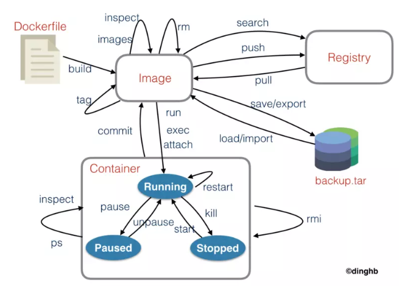

# Docker

## 1 image

```bash
#拉取hello-world实例
docker image pull hello-world

#查看本地image
docker image ls 

#删除image实例
# rmi: remove one or more images
docker rmi [imageID]

```

## 2 container

```bash
#列出本机正在运行的容器
docker container ls 

#列出本机所有容器，包括终止运行的容器
docker container ls --all

#本地运行hello-world实例
docker container run hello-world 

#手动终止实例(针对不会自动终止的容器)
docker container kill [containID] 

#删除容器文件(终止的同时连带本地文件一并删除)
# rm : remove one or more containers
docker container rm [containerID]
docker rm [containerID]
```

## 3 常用命令



## 4 Dockerfile

自动构建Docker镜像的配置文件，用户可以使用Dockerfile快速创建自定义的镜像。

Dockerfile分为四个部分：

1. 基础镜像信息指令FROM
2. 维护者信息指令MAINTAINER
3. 镜像操作指令RUN、EVN、ADD和WORKDIR等
4. 容器启动指令CMD、ENTRYPOINT和USER等


举例：

```
FROM python:2.7
MAINTAINER Angel_Kitty <angelkitty6698@gmail.com>
COPY . /app
WORKDIR /app
RUN pip install -r requirements.txt
EXPOSE 5000
ENTRYPOINT ["python"]CMD ["app.py"]
```

执行过程：

* 从Docker Hub上Pull下Python2.7的基础镜像
* 显示维护者信息
* Copy当前目录到容器中的/App目录下，复制本地主机的\<src>(Dockerfile所在目录的相对路径)到容器里的\<dest>
* 指定工作路径为/App
* 安装依赖包
* 暴露5000端口
* 启动App

### 4.1 FROM

FROM 是用于指定基础的 images ，一般格式为 FROM <image> or FORM <image>:<tag>。

所有的 Dockerfile 都应该以 FROM 开头，FROM 命令指明 Dockerfile 所创建的镜像文件以什么镜像为基础，FROM 以后的所有指令都会在 FROM 的基础上进行创建镜像。
可以在同一个 Dockerfile 中多次使用 FROM 命令用于创建多个镜像。比如我们要指定 Python 2.7 的基础镜像，我们可以像如下写法一样：

```
FROM python:2.7
```

### 4.2 MAINTAINER

MAINTAINER 是用于指定镜像创建者和联系方式，一般格式为 MAINTAINER <name>。


### 4.3 COPY

  COPY 是用于复制本地主机的 <src> (为 Dockerfile 所在目录的相对路径)到容器中的 <dest>。

当使用本地目录为源目录时，推荐使用 COPY 。一般格式为 COPY <src><dest> 。

### 4.4 WORKDIR

  WORKDIR 用于配合 RUN，CMD，ENTRYPOINT 命令设置当前工作路径。

可以设置多次，如果是相对路径，则相对前一个 WORKDIR 命令。默认路径为/。一般格式为 WORKDIR /path/to/work/dir。  


### 4.5 RUN

RUN 用于容器内部执行命令。每个 RUN 命令相当于在原有的镜像基础上添加了一个改动层，原有的镜像不会有变化。一般格式为 RUN <command>。


### 4.6 EXPOSE

EXPOSE 命令用来指定对外开放的端口。一般格式为 EXPOSE <port> [<port>...]。


### 4.7 ENTRYPOINT

NTRYPOINT 可以让你的容器表现得像一个可执行程序一样。一个 Dockerfile 中只能有一个 ENTRYPOINT，如果有多个，则最后一个生效。
ENTRYPOINT 命令也有两种格式：

- ENTRYPOINT ["executable", "param1", "param2"] ：推荐使用的 Exec 形式。
- ENTRYPOINT command param1 param2 ：Shell 形式。