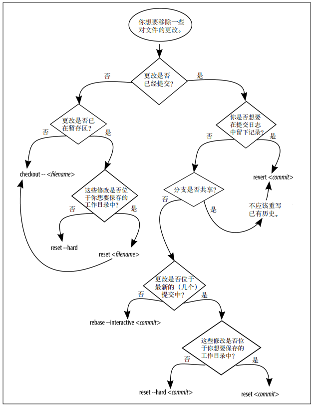
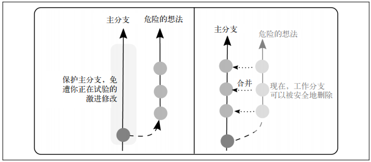

# git 团队协作

##  1 思维模式

创造性思维：预见未来、另辟蹊径、头脑风暴、灵光一现、勇于质疑、保持专注

理解性思维：理解信息（分析型）、理解他人（同理心）

评估现状、阐明现状、善于组织、敏锐感知、产生共鸣、善于表达


决策性思维：分清主次、善于总结、验证结论、身体力行、价值驱动、相信直觉


## 2 常用术语

forking：派生

fork

check out：签出

stash：储藏（暂存更改、允许随后拉取刚刚储藏的工作并重新应用）

pull：抓取

fetch：拉取

merge：合并

branch：分支

tracked：跟踪

push：推送

github中的派生相当于git command 中的clone


merge conflict：合并冲突

Issues：专门板块，列出所有bug报告、功能请求和项目相关讨论（工单系统）


## 3 基本命令

### 3.1 shell

| 命令              | 用途                                  |
| ----------------- | ------------------------------------- |
| cd ~              | 转到你的home目录                      |
| mkdir             | 创建新目录                            |
| cd directory_name | 转到指定目录                          |
| ls -a             | 在OS X和基于Linux的系统下列出隐藏文件 |
| dir               | 在Windows下列出文件                   |
| touch file_name   | 使用指定名称创建新的空文件            |


### 3.2 git

| 命令                                                         | 用途                                                     |
| ------------------------------------------------------------ | -------------------------------------------------------- |
| git clone URL                                                | 下载远程仓库的副本                                       |
| git init                                                     | 将当前目录转换成一个新的Git仓库                          |
| git status                                                   | 获取仓库状态报告                                         |
| git add --all                                                | 将所有修改过的文件和新文件添加至仓库的暂存区             |
| git commit -m "message"                                      | 将所有暂存的文件提交至仓库                               |
| git log                                                      | 查看项目历史                                             |
| git log --oneline                                            | 查看压缩过的项目历史                                     |
| git branch --list                                            | 列出所有本地分支                                         |
| git branch --all                                             | 列出本地和远程分支                                       |
| git branch --remotes                                         | 列出所有远程分支                                         |
| git checkout --track remote_name/branch                      | 创建远程分支的副本，在本地使用                           |
| git checkout branch                                          | 切换到另一个本地分支                                     |
| git checkout -b branch branch_parent                         | 从指定分支创建一个新分支                                 |
| git add filename(s)                                          | 仅暂存并准备提交指定文件                                 |
| git add --patch filename                                     | 仅暂存并准备提交部分文件                                 |
| git reset HEAD filename                                      | 从在那存取移除提出的文件修改                             |
| git commit --amend                                           | 使用当前暂存的修改更新之前的提交，并提供一个新的提交消息 |
| git show commit                                              | 输出某个提交的详细信息                                   |
| git tag tag commit                                           | 为某个提交对象打上标签                                   |
| git tag                                                      | 列出所有标签                                             |
| git show tag                                                 | 输出所有带标签提交的详细信息                             |
| git remote add remote_name URL                               | 创建一个指向远程仓库的引用                               |
| git push                                                     | 将当前分支上的修改上传至远程仓库                         |
| git remote --verbose                                         | 列出所有可用远程连接中fetch和push命令使用的URL           |
| git push --set-upstream remote_name branch_local branch_remote | 将本地分支的副本推送至远程服务器                         |
| git merge branch                                             | 将当前存储在另一分支的提交并入当前分支                   |
| git push --delete remote_name branch_remote                  | 在远程服务器中移除指定名称的分支                         |


##  许可证

MIT：允许注明原作者的前提下自由使用代码，并且你不需要为衍生的软件负责

Apache：明确将原作者的专利授权给用户，并要求用户提供变更说明，描述你的作品在之前的版本上做了哪些修改。

GNU GPL：要求作品或衍生品的分发者将源码以相同协议共享


## 4 常用命令

### 4.1 初始化目录的版本控制

```git
git init
```

### 4.2 检查仓库的当前状态

```
git status	
```

### 4.3 将仓库中所有文件添加到暂存区

```
git add --all
```

### 4.4 件所有暂存的文件提交至存仓库

```
git commit -m
```

### 4.5 使用log命令查看仓库历史纪录

```
git log
```

### 4.6 查看缩短的项目历史纪录

```
git log --oneline
```

### 4.7 列出本地分支

``` 
git branch --list
```

### 4.8 列出所有分支

```
git branch --all
```

### 4.9 列出远程分支

``` 
git branch --remotes
```

### 4.10 更新远程分支列表

```
git fetch
```

### 4.11 创建新分支操作详解
#### 4.11.1 创建新分支

```
git branch 分支名称
```

#### 4.11.2 分支切换


```
git checkout 分支名称
```

#### 4.11.3 从主分支创建一个新的开发分支

```
git checkout -b 1-process_notes master
```

#### 4.11.4 将工单分支并入你的主分支

```
git checkout master
git merge 1-process_notes
```

#### 4.11.5 删除这个分支的本地副本
```
git branch --delete 1-process_notes
```

#### 4.11.6 删除不再需要的远程分支

```
git push --delete my_gitlab 1-process_notes
```


## 5 回滚、还原、 重置和变基

### 5.1 撤销

| To do                                                        | Note                                                     | Solution                    |
| ------------------------------------------------------------ | -------------------------------------------------------- | --------------------------- |
| 舍弃工作目录中对一个文件的修改                               | 修改的文件未被暂存或提交                                 | checkout --filename         |
| 舍弃工作目录中所有未保存的变更                               | 文件已暂存，但未被提交                                   | reset --hard                |
| 合并与某个特定提交（但不含）之间的多个提交                   |                                                          | reset commit                |
| 移除所有未保存的变更，包含未跟踪的文件                       | 修改的文件未被提交                                       | clean -fd                   |
| 移除所有已暂存的变更和在某个提交之前提交的工作，但不溢出工作目录中的新文件 |                                                          | reset --hard commit         |
| 移除之前的工作，但完整保留提交历史纪录（”前进时回滚“）       | 分支已经被发布、工作目录是干净的                         | revert commit               |
| 从分支历史纪录中移除一个单独的提交                           | 修改的文件已经被提交，工作目录是干净的，分支尚未进行发布 | rebase --interactive commit |
| 保留之前的工作，但与另一提交合并                             | 选择squash（压缩）选项                                   | rebase --interactive commit |

### 5.2 分支





#### 5.2.1 用分支来测试修改

```git
git checkout -b experimental_idea
git add --all
git commit
//使用--squash参数合并，可将所有提交并入一个提交，以后无法撤销分支

```

#### 5.2.2 将分支并入主分支

```git
git checkout master
git merge experimental_idea --squash
git commit
```

#### 5.2.3 删除分支

```git
git branch --delete experimental_idea
```

### 5.3 分布变基

#### 5.3.1 开始变基

```git
git checkout master
git pull --rebase=preserve remote_nickname master
//确保父分支的本地副本与项目主仓库中最新的提交同步

git checkout feature
//当前分支上的修改与主项目不同步，而主项目中的新工作尚未被引入

git rebase master
//开始变基过程
```

#### 5.3.2 文件删除造成的变基中冲突

```git
git reset HEAD filename
//清楚暂存区，将指针回退到最新的一个已知的提交
```

#### 5.3.3 单个文件合并冲突造成的变基中冲突

## 5.4 还原提交

```git
git revert c545620	
```

